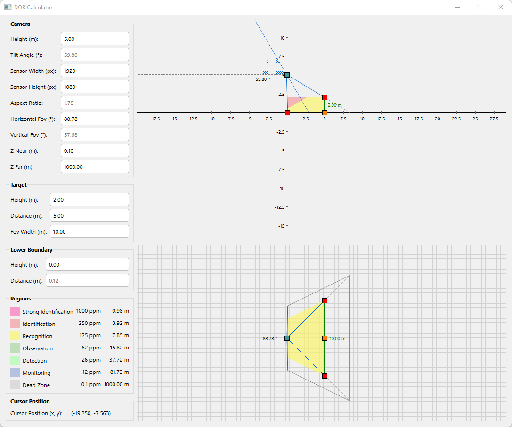
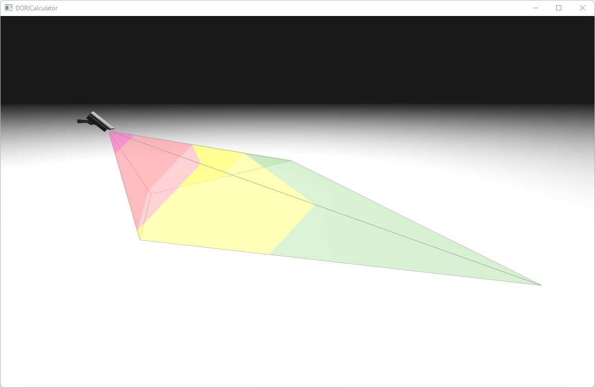

# DORI Calculator
DORI (Detection - Observation - Recognition - Identification) limit calculator based on IEC EN62676-4: 2015 International Standard.

## Build
1) Install `Qt 5.15.2`.
2) Open `DORICalculator.pro` with `QtCreator` and build & run it. 

## Screenshots

## Keywords
`C++`, `Qt 5.15.2`, `Eigen`, `OpenGL`, `GLSL`, `JSVG`, `DORI`, `CCTV Positioning`
